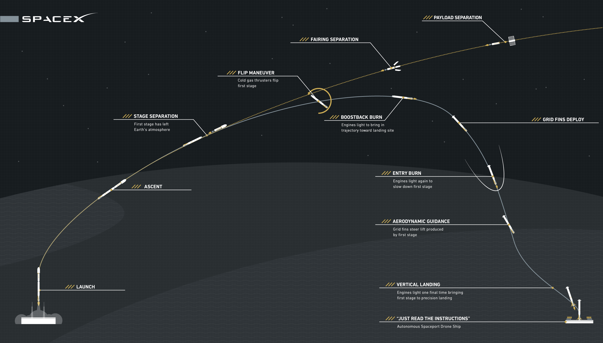
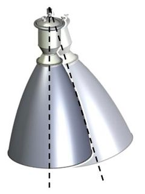
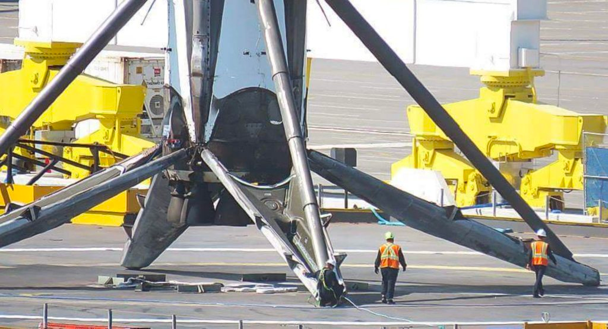
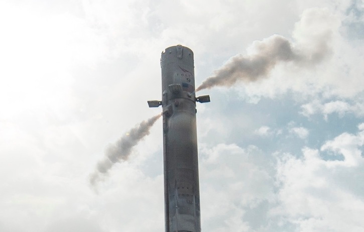

# Simulador SpaceX

El taller consiste en simular un cohete de SpaceX, en concreto un Falcon 9. Las físicas y controles de posición se han
simplificado y son ficticios siguiendo un poco la lógica.

Tendremos los siguientes micro servicios funcionando entre sí:

- **falcon9**: Este repositorio es el principal que dará órdenes y enviará información al resto de MS.
- **coldgasthusters**: Control del sistema de empuje mediante gas presurizado.
- **engine**: Control de los 8 motores Merlin
- **gimbal**: Control del sistema gimbal de los 8 motores Merlin
- **gps**: Control del sistema de posicionamiento
- **gridfins**: Control de las rejillas para estabilizar el cohete
- **kerosene**: Control del sistema de Keroseno
- **landinglegs**: Control de las 4 patas de aterrizaje
- **lox**: Control del sistema de Oxígeno líquido
- **payload**: Control de la carga que vamos a desplegar en el espacio
- **secondstage**: Control de la segunda fase del cohete, que se separa y contiene el payload
- **turbopump**: Control de la turbina y bombas para poder mezclar RP-1 y LOX

Controlaremos las diferentes fases de una misión del lanzamiento de un satélite starlink con un Falcon 9, como podemos
ver en la siguiente imagen:



## Installation

Para ejecutar en local: 

```bash
./gradlew build 
./gradlew bootRun 
```

## Fases de la misión

### 1.0 Check - ```GET https://{api-url}/api/{microservice}/check```
Se trata de que todos los micro servicios respondan con un mensaje de Health Check, el micro servicio principal
(este proyecto) espera los valores por defecto de todos los campos:

Por ejemplo del Health Check del motor será:
```json
{
  "engine": {
    "mode": "OFF",
    "throttle": 0,
    "chamberPressure": 0
  }
}
```
---

### 2.0 Launch
Se trata de la fase de lanzamiento, y los micro servicios que entran en marcha son los siguientes:

#### 2.1 Engine - ```POST https://{api-url}/api/engine/launch```
El motor tiene que primero presurizar la cámara a `2000` psia y poner él `Mode` en `FULL`, esto quiere decir que el 
atributo `throttle` hay que ajustarlo al 100%. 

**IMPORTANTE**: No se puede ajustar él `Mode` y `throttle` a la potencia
máxima si la cámara no se ha presurizado, tampoco podemos presurizar la cámara de golpe, cada `100 ms` debemos incrementar
`100 psia` hasta llegar al valor de `2000`. Quiere decir que tardará `2 segundos` en `incrementar la presión de 0 a 2000`.

Hay que tener en cuenta que tenemos 8 motores en comunicación con el cohete, en la parte de simulación con el Hardware
del cohete tendremos una interfaz controlando 8 motores.

La respuesta de este endpoint al finalizar los ajustes debe ser:
```json
{
  "engine": {
    "mode": "FULL",
    "throttle": 1,
    "chamberPressure": 2000
  }
}
```

#### 2.2 Kerosene Control - ```POST https://{api-url}/api/kerosene/launch```
El control de Keroseno primero de todo debe activar la `mainValve` y seguidamente comenzar a bombear hasta llegar a 
`fuelPumpPercentage` del 100 % con el valor `1`, donde él `flowRate` irá incrementando hasta `801 kg/s` de combustible al 100%.

**IMPORTANTE**: No se puede ajustar él `fuelPumpPercentage` si la `mainValve` no está abierta. También debemos incrementar
la potencia de bombeo `40 kg/s` cada `100 ms`.

La respuesta de este endpoint al finalizar los ajustes debe ser:
```json
{
  "kerosene": {
    "mainValve": true,
    "ratio": 2.4,
    "fuelPumpPercentage": 1,
    "flowRate": 801
  }
}
```

#### 2.3 LOX Control - ```POST https://{api-url}/api/lox/launch```
El control de oxígeno líquido primero de todo debe activar la `mainValve` y seguidamente comenzar a bombear hasta llegar a
`fuelPumpPercentage` del 100 % con el valor `1`, donde él `flowRate` irá incrementando hasta `1919 kg/s` de combustible al 100%.

**IMPORTANTE**: No se puede ajustar él `loxPumpPercentage` si la `mainValve` no está abierta. También debemos incrementar
la potencia de bombeo `95 kg/s` cada `100 ms`.

La respuesta de este endpoint al finalizar los ajustes debe ser:
```json
{
  "lox": {
    "mainValve": true,
    "ratio": 2.4,
    "loxPumpPercentage": 1,
    "flowRate": 1919
  }
}
```


#### 2.4 Turbo Pump - ```POST https://{api-url}/api/turbopump/launch```
Para el funcionamiento del `Kerosene` y él `LOX` tenemos una turbina y dos bombas conectadas que son las que bombean los
diferentes combustibles. Esta bomba pone en marcha una turbina con él `throttle` al 100% donde las `rpm` irán incrementando
hasta `36000 rpm` con un resultado total de `hp` de `10000 hp`. Las `rpm` irán incrementando `1800 rpm` cada `100 ms`.

**IMPORTANTE**: Del JSON recibido deberemos comprobar que él `ratio` tanto del `lox` cómo `kerosene` corresponden 
con los `flowRate` del kerosene y lox, la fórmula es la siguiente: `lox flowRate` / `kerosene flowRate` = `ratio`, con 
un margen de error de un 5%.

La respuesta de este endpoint al finalizar los ajustes debe ser:
```json
{
  "turbopump": {
    "throttle": 1,
    "rpm": 36000,
    "hp": 10000
  }
}
```


---
### 3.0 Ascent
En la fase de ascenso entran en marcha el GPS, INS y Gimbal.

#### 3.1 GPS - ```POST https://{api-url}/api/gps/ascent```
El GPS recibirá las coordenadas destino y se sitúa en las siguientes coordenadas:

##### Coordenadas actuales (las simulamos): 
    **Latitude**	28.573469
    **Longitude**	-80.651070

##### Coordenadas de aterrizaje:
    **Latitude** 28.775245058791235
    **Longitude** -77.38535548520339

Se deben de hacer check que las coordenadas de destino están a menos de 350 km de radio.

La respuesta de este endpoint al finalizar los ajustes debe ser:
```json
{
  "gps": {
    "actualLatitude": 28.573469,
    "actualLongitude": -80.651070,
    "targetLatitude": 28.775245058791235,
    "targetLongitude": -77.38535548520339
  }
}
```

#### 3.2 Gimbal - ```POST https://{api-url}/api/gimbal/ascent```
Primero de todo, antes de implementar este micro servicio hay que entender que es `X Y Z` o `Roll, Pitch, Yaw` para el
control de orientación de un cohete (ver imagen).


Para este endpoint usaremos `**Yaw** para corregir Latitude` y `**Pitch** para corregir Longitud`.
El Gimbal debe funcionar de la siguiente manera, por cada diferencia entre coordenadas actuales y de aterrizaje se deberá
aumentar `1º`, por ejemplo `Longitude -80.651070 y -77.38535548520339` el resultado será un `Yaw` de `3,26º`, en cambio
a la inversa `Longitude -77.38535548520339 y -80.651070` el resultado será un `Yaw` de `-3,26º`

**IMPORTANTE**: Se debe controlar que los 3 atributos no pueden pasar de los 20º, ya que es el giro máximo del motor en
toda su circumferencia, en X Y Z tanto positivo como negativo.



Hay que tener en cuenta que tenemos 8 motores, por lo tanto 8 Gimbal en comunicación con el cohete (todos actúan en la
misma posición a la vez).


La respuesta de este endpoint al finalizar los ajustes debe ser:
```json
{
  "gimbal": {
    "roll": 0,
    "pitch": 0,
    "yaw": 3.26
  }
}
```

---

### 4.0 Stage separation


#### 4.1 Engine - ```POST https://{api-url}/api/engine/stageseparation```
El motor tiene que primero despresurizar la cámara a `1000` psia y poner él `Mode` en `OFF`, esto quiere decir que el
atributo `throttle` hay que ajustarlo al 0%. Se puede realizar directamente.

La respuesta de este endpoint al finalizar los ajustes debe ser:
```json
{
  "engine": {
    "mode": "OFF",
    "throttle": 0,
    "chamberPressure": 1000
  }
}
```

#### 4.2 Kerosene Control - ```POST https://{api-url}/api/kerosene/boostbackburn```
El control de Keroseno primero de todo debe desactivar la `mainValve` y seguidamente parar de y pasar
`fuelPumpPercentage` al 0 % con el valor `0`, donde él `flowRate` pasa a `0`.

La respuesta de este endpoint al finalizar los ajustes debe ser:
```json
{
  "kerosene": {
    "mainValve": false,
    "ratio": 2.4,
    "fuelPumpPercentage": 0,
    "flowRate": 0
  }
}
```

#### 4.3 LOX Control - ```POST https://{api-url}/api/lox/boostbackburn```
El control de LOX primero de todo debe desactivar la `mainValve` y seguidamente parar de y pasar
`loxPumpPercentage` al 0 % con el valor `0`, donde él `flowRate` pasa a `0`.

La respuesta de este endpoint al finalizar los ajustes debe ser:
```json
{
  "lox": {
    "mainValve": false,
    "ratio": 2.4,
    "loxPumpPercentage": 0,
    "flowRate": 0
  }
}
```

#### 4.4 Turbo Pump - ```POST https://{api-url}/api/turbopump/boostbackburn```
Para el funcionamiento del `Kerosene` y él `LOX` tenemos una turbina y dos bombas conectadas que son las que bombean los
diferentes combustibles. Esta bomba se debe desactivar con él `throttle` al 0% donde las `rpm` disminuyen hasta `0 rpm` 
con un resultado total de `hp` de `0 hp`.

La respuesta de este endpoint al finalizar los ajustes debe ser:
```json
{
  "turbopump": {
    "throttle": 0,
    "rpm": 0,
    "hp": 0
  }
}
```

#### 4.2 Second Stage - ```POST https://{api-url}/api/secondstage/stageseparation```
Debemos desacoplar la `Second Stage` del `Falcon 9` activando `enableSeparation` a true e informando al cohete. El `throttle`
debe incrementar hasta él `100%` en `2000 ms`, pasados `3000 ms` después de activar `enableSeparation`.

https://www.youtube.com/watch?v=Vpsfy4npMhY

**IMPORTANTE**: Del JSON que recibe se debe controlar que en el `engine` su atributo `mode` este `OFF` y 
`throttle` al `0`.

```json
{
  "secondstage": {
    "enableSeparation": true,
    "throttle": 1,
    "fairingSeparation": false,
    "payloadSeparation": false
  }
}
```

---
### 5.0 Flip maneuver
Esta etapa se realiza seguida de la `Stage Separation` por eso los controles anteriores, ya que la maniobra de 
giro del cohete debe estar sincronizada después para que no choque con él `Falcon 9`.

#### 5.1 Cold Gas Thrusters - ```POST https://{api-url}/api/coldgasthrusters/flipmaneuver```
Se activará él `ColdGasThruster` `right` durante `13000 ms` y luego para compensar la maniobra él `ColdGasThruster` `left`
`1000 ms`.

**IMPORTANTE**: Del JSON que recibe se debe controlar que en el `engine` su atributo `mode` este `OFF` y
`throttle` al `0`.

La respuesta de este endpoint al finalizar los ajustes debe ser:

```json
{
  "coldgasthusters": [
    {
      "right": {
        "thrust": 1,
        "secondsOfThrust": 13
      },
      "left": {
        "thrust": 1,
        "secondsOfThrust": 1
      }
    }
  ]
}

```


#### 5.2 Gimbal - ```POST https://{api-url}/api/gimbal/flipmaneuver```
Reset de del Gimbal del `roll`, `pitch` y `yaw` a `0º`.

La respuesta de este endpoint al finalizar los ajustes debe ser:
```json
{
  "gimbal": {
    "roll": 0,
    "pitch": 0,
    "yaw": 0
  }
}
```
---
### 6.0 Boost back burn

#### 6.1 Engine - ```POST https://{api-url}/api/engine/boostbackburn```
El motor tiene que primero presurizar la cámara a `1472` psia y poner él `Mode` en `LIGHT`, esto quiere decir que el
atributo `throttle` hay que ajustarlo al 70%.

**IMPORTANTE**: No se puede ajustar él `Mode` y `throttle` a la potencia
indicada si la cámara no se ha presurizado, tampoco podemos presurizar la cámara de golpe, cada `100 ms` debemos incrementar
`300 psia` hasta llegar al valor de `1472`. Quiere decir que tardará unos `500 ms` en `incrementar la presión de 0 a 1472`.

Hay que tener en cuenta que tenemos 8 motores en comunicación con el cohete, en la parte de simulación con el Hardware
del cohete tendremos una interfaz controlando 8 motores.

La respuesta de este endpoint al finalizar los ajustes debe ser:
```json
{
  "engine": {
    "mode": "FULL",
    "throttle": 0.7,
    "chamberPressure": 1472
  }
}
```

#### 6.2 Kerosene Control - ```POST https://{api-url}/api/kerosene/boostbackburn```
El control de Keroseno primero de todo debe activar la `mainValve` y seguidamente comenzar a bombear hasta llegar a
`fuelPumpPercentage` del 70 % con el valor `0.7`, donde él `flowRate` irá incrementando hasta `560 kg/s` de combustible al 100%.

**IMPORTANTE**: No se puede ajustar él `fuelPumpPercentage` si la `mainValve` no está abierta. También debemos incrementar
la potencia de bombeo `40 kg/s` cada `100 ms`.

La respuesta de este endpoint al finalizar los ajustes debe ser:
```json
{
  "kerosene": {
    "mainValve": true,
    "ratio": 2.4,
    "fuelPumpPercentage": 0.7,
    "flowRate": 560
  }
}
```

#### 6.3 LOX Control - ```POST https://{api-url}/api/lox/boostbackburn```
El control de oxígeno líquido primero de todo debe activar la `mainValve` y seguidamente comenzar a bombear hasta llegar a
`fuelPumpPercentage` del 70 % con el valor `0.7`, donde él `flowRate` irá incrementando hasta `1343 kg/s` de combustible al 70%.

**IMPORTANTE**: No se puede ajustar él `loxPumpPercentage` si la `mainValve` no está abierta. También debemos incrementar
la potencia de bombeo `95 kg/s` cada `100 ms`.

La respuesta de este endpoint al finalizar los ajustes debe ser:
```json
{
  "lox": {
    "mainValve": true,
    "ratio": 2.4,
    "loxPumpPercentage": 0.7,
    "flowRate": 1343
  }
}
```

#### 6.4 Turbo Pump - ```POST https://{api-url}/api/turbopump/boostbackburn```
Para el funcionamiento del `Kerosene` y él `LOX` tenemos una turbina y dos bombas conectadas que son las que bombean los
diferentes combustibles. Esta bomba pone en marcha una turbina con él `throttle` al 70% donde las `rpm` irán incrementando
hasta `25200 rpm` con un resultado total de `hp` de `7000 hp`. Las `rpm` irán incrementando `1800 rpm` cada `100 ms`.

**IMPORTANTE**: Del JSON recibido deberemos comprobar que él `ratio` tanto del `lox` cómo `kerosene` corresponden
con los `flowRate` del kerosene y lox, la fórmula es la siguiente: `lox flowRate` / `kerosene flowRate` = `ratio`, con
un margen de error de un 5%.

La respuesta de este endpoint al finalizar los ajustes debe ser:
```json
{
  "turbopump": {
    "throttle": 0.7,
    "rpm": 25200,
    "hp": 7000
  }
}
```

---
### 7.0 Grid fins deploy

#### 7.1 Engine - ```POST https://{api-url}/api/engine/gridfinsdeploy```
El motor tiene que primero despresurizar la cámara a `1000` psia y poner él `Mode` en `OFF`, esto quiere decir que el
atributo `throttle` hay que ajustarlo al 0%. Se puede realizar directamente.

La respuesta de este endpoint al finalizar los ajustes debe ser:
```json
{
  "engine": {
    "mode": "OFF",
    "throttle": 0,
    "chamberPressure": 1000
  }
}
```

#### 7.2 Grid fins - ```POST https://{api-url}/api/gridfins/gridfinsdeploy```
En este endpoint se desplegarán las 4 Grid Fins, poniendo a `true` el atributo `deploy` en `ZMinus, ZPlus, YMinus e YPlus`,
donde `Z` hace referencia `Yaw` e `Y` a `Pitch`.

**IMPORTANTE**: Si la temperatura es mayor a `540` no se abrirán.

La respuesta de este endpoint al finalizar los ajustes debe ser:
```json
{
  "gridfins": [
    {
        "zminus": {
          "deploy": true,
          "temperature": 300,
          "upDown": 0,
          "leftRight": 0
        }
    },
    {
      "zplus": {
        "deploy": true,
        "temperature": 300,
        "upDown": 0,
        "leftRight": 0
      }
    },

    {
      "yminus": {
        "deploy": true,
        "temperature": 300,
        "upDown": 0,
        "leftRight": 0
      }
    },
    {
      "yplus": {
        "deploy": true,
        "temperature": 300,
        "upDown": 0,
        "leftRight": 0
      }
    }
  ]
}
```
---

### 8.0 Entry Burn
En esta `fase a 70 kms de altura` el cohete enciende los motores para la `reentrada`, esta se hace a `8000 km/h`.
Debemos controlar el Falcon 9 de la siguiente manera.

#### 8.1 Engine - ```POST https://{api-url}/api/engine/entryburn```
El motor tiene que primero presurizar la cámara a `1472` psia y poner él `Mode` en `LIGHT`, esto quiere decir que el
atributo `throttle` hay que ajustarlo al 70%.

**IMPORTANTE**: No se puede ajustar él `Mode` y `throttle` a la potencia
indicada si la cámara no se ha presurizado, tampoco podemos presurizar la cámara de golpe, cada `100 ms` debemos incrementar
`300 psia` hasta llegar al valor de `1472`. Quiere decir que tardará unos `500 ms` en `incrementar la presión de 0 a 1472`.

Hay que tener en cuenta que tenemos 8 motores en comunicación con el cohete, en la parte de simulación con el Hardware
del cohete tendremos una interfaz controlando 8 motores.

La respuesta de este endpoint al finalizar los ajustes debe ser:
```json
{
  "engine": {
    "mode": "FULL",
    "throttle": 0.7,
    "chamberPressure": 1472
  }
}
```

#### 8.2 Kerosene Control - ```POST https://{api-url}/api/kerosene/entryburn```
El control de Keroseno primero de todo debe activar la `mainValve` y seguidamente comenzar a bombear hasta llegar a
`fuelPumpPercentage` del 70 % con el valor `0.7`, donde él `flowRate` irá incrementando hasta `560 kg/s` de combustible al 100%.

**IMPORTANTE**: No se puede ajustar él `fuelPumpPercentage` si la `mainValve` no está abierta. También debemos incrementar
la potencia de bombeo `40 kg/s` cada `100 ms`.

La respuesta de este endpoint al finalizar los ajustes debe ser:
```json
{
  "kerosene": {
    "mainValve": true,
    "ratio": 2.4,
    "fuelPumpPercentage": 0.7,
    "flowRate": 560
  }
}
```

#### 8.3 LOX Control - ```POST https://{api-url}/api/lox/entryburn```
El control de oxígeno líquido primero de todo debe activar la `mainValve` y seguidamente comenzar a bombear hasta llegar a
`fuelPumpPercentage` del 70 % con el valor `0.7`, donde él `flowRate` irá incrementando hasta `1343 kg/s` de combustible al 70%.

**IMPORTANTE**: No se puede ajustar él `loxPumpPercentage` si la `mainValve` no está abierta. También debemos incrementar
la potencia de bombeo `95 kg/s` cada `100 ms`.

La respuesta de este endpoint al finalizar los ajustes debe ser:
```json
{
  "lox": {
    "mainValve": true,
    "ratio": 2.4,
    "loxPumpPercentage": 0.7,
    "flowRate": 1343
  }
}
```

#### 8.4 Turbo Pump - ```POST https://{api-url}/api/turbopump/entryburn```
Para el funcionamiento del `Kerosene` y él `LOX` tenemos una turbina y dos bombas conectadas que son las que bombean los
diferentes combustibles. Esta bomba pone en marcha una turbina con él `throttle` al 70% donde las `rpm` irán incrementando
hasta `25200 rpm` con un resultado total de `hp` de `7000 hp`. Las `rpm` irán incrementando `1800 rpm` cada `100 ms`.

**IMPORTANTE**: Del JSON recibido deberemos comprobar que él `ratio` tanto del `lox` cómo `kerosene` corresponden
con los `flowRate` del kerosene y lox, la fórmula es la siguiente: `lox flowRate` / `kerosene flowRate` = `ratio`, con
un margen de error de un 5%.

La respuesta de este endpoint al finalizar los ajustes debe ser:
```json
{
  "turbopump": {
    "throttle": 0.7,
    "rpm": 25200,
    "hp": 7000
  }
}
```
---

### 9.0 Aerodynamic Guidance


Esta fase debemos controlar él `Yaw (Z)` y `Pitch (Y)` del Falcon 9 de la siguiente manera:

#### 9.1 Grid fins - ```POST https://{api-url}/api/gridfins/aerodynamicguidance```
Leeremos las coordenadas de GPS recibidas en el Body de la petición, que llegarán de la siguiente manera:

```json
{
  "gps": {
    "actualLatitude": 28.573469,
    "actualLongitude": -80.651070,
    "targetLatitude": 28.775245058791235,
    "targetLongitude": -77.38535548520339
  }
}
```

En este endpoint se desplegarán las 4 Grid Fins, poniendo a `true` el atributo `deploy` en `ZMinus, ZPlus, YMinus e YPlus`,
donde `Z` hace referencia `Yaw` e `Y` a `Pitch`.

`Y` hará referencia a `Latitude` y `Z` hará referencia a `Longitude`, pasaremos los valores de coordenadas a un número
con el valor decimal en el punto de la coordenada y calculando con la siguiente fórmula los grados de cada Grid fin:

```
ZMinus = (-80,651070) - (-77,38535548520339) = -3,26 degrees
ZPlus = Invertida a ZMinus = 3,26 degrees

YMinus = (28,573469) - (28,775245058791235) = -0,20 degrees
YPlus = Invertida a YMinus = 0,20 degrees
```

La respuesta de este endpoint al finalizar los ajustes debe ser:
```json
{
  "gridfins": [
    {
        "zminus": {
          "deploy": true,
          "temperature": 300,
          "leftRight": -3.26
        }
    },
    {
      "zplus": {
        "deploy": true,
        "temperature": 300,
        "leftRight": 3.26
      }
    },

    {
      "yminus": {
        "deploy": true,
        "temperature": 300,
        "leftRight": -0.20
      }
    },
    {
      "yplus": {
        "deploy": true,
        "temperature": 300,
        "leftRight": 0.20
      }
    }
  ]
}
```
---
### 10.0 Vertical Landing


#### 10.1 Grid fins - ```POST https://{api-url}/api/gridfins/verticallanding```
Haremos lo mismo que en el punto 9.1 pero con las nuevas coordenadas.

#### 10.2 Engine - ```POST https://{api-url}/api/engine/verticallanding```
Haremos lo mismo que en el punto 6.1 Engine.

#### 10.3 Gimbal - ```POST https://{api-url}/api/gimbal/verticallanding```
Haremos lo mismo que en el punto 3.2 Gimbal.

#### 10.4 Kerosene - ```POST https://{api-url}/api/kerosene/verticallanding```
Haremos lo mismo que en el punto 6.2 Kerosene.

#### 10.5 LOX - ```POST https://{api-url}/api/lox/verticallanding```
Haremos lo mismo que en el punto 6.3 LOX.

#### 10.6 LOX - ```POST https://{api-url}/api/turbopump/verticallanding```
Haremos lo mismo que en el punto 6.4 Turbo Pump.

#### 10.7 Landing Legs - ```POST https://{api-url}/api/landinglegs/verticallanding```


Para abrir todas las patas del Falcon 9 debemos actualizar todos los atributos de las patas a true e informar al Falcon 9.

La respuesta de este endpoint al finalizar los ajustes debe ser:
```json
{
  "landinglegs": {
    "Leg0": true,
    "Leg90": true,
    "Leg180": true,
    "Leg270": false
  }
}
```

---
### 11.0 Landed

#### 11.1 Grid fins - ```POST https://{api-url}/api/gridfins/landed```
Cerraremos las Grid Fins.

La respuesta de este endpoint al finalizar los ajustes debe ser:
```json
{
  "gridfins": [
    {
        "zminus": {
          "deploy": false,
          "temperature": 20,
          "upDown": 0,
          "leftRight": 0
        }
    },
    {
      "zplus": {
        "deploy": false,
        "temperature": 20,
        "upDown": 0,
        "leftRight": 0
      }
    },

    {
      "yminus": {
        "deploy": false,
        "temperature": 20,
        "upDown": 0,
        "leftRight": 0
      }
    },
    {
      "yplus": {
        "deploy": false,
        "temperature": 20,
        "upDown": 0,
        "leftRight": 0
      }
    }
  ]
}
```

#### 11.2 Engine - ```POST https://{api-url}/api/engine/landed```
Haremos lo mismo que en el punto 4.1 Engine.

#### 11.3 Gimbal - ```POST https://{api-url}/api/gimbal/landed```
Haremos lo mismo que en el punto 5.2 Gimbal.

#### 11.4 Kerosene - ```POST https://{api-url}/api/kerosene/landed```
Haremos lo mismo que en el punto 4.2 Kerosene.

#### 11.5 LOX - ```POST https://{api-url}/api/lox/landed```
Haremos lo mismo que en el punto 4.3 LOX.

#### 11.6 LOX - ```POST https://{api-url}/api/turbopump/landed```
Haremos lo mismo que en el punto 4.4 Turbo Pump.

#### 11.7 Cold Gas - ```POST https://{api-url}/api/coldgasthrusters/landed```
Se activará él `ColdGasThruster` `right` y `left` durante `5000 ms` para vaciar el gas restante.

La respuesta de este endpoint al finalizar los ajustes debe ser:
```json
{
  "coldgasthusters": [
    {
      "right": {
        "thrust": 1,
        "secondsOfThrust": 5
      },
      "left": {
        "thrust": 1,
        "secondsOfThrust": 5
      }
    }
  ]
}
```



---
### 12.0 Fairing separation - ```POST https://{api-url}/api/secondstage/fairingseparation```
Cambiaremos el atributo `fairingSeparation` e informaremos al Hardware del second stage. Devolveremos el siguiente json:

```json
{
  "secondstage": {
    "enableSeparation": true,
    "throttle": 1,
    "fairingSeparation": true,
    "payloadSeparation": false
  }
}
```

---
### 12.0 Payload separation - ```POST https://{api-url}/api/secondstage/payloadseparation```
Primero de todo apagaremos el motor, bajando throttle a 0%.

Cambiaremos el atributo `payloadeparation` e informaremos al Hardware del second stage. Devolveremos el siguiente json:

**IMPORTANTE**: El payload no se puede soltar si el motor del `secondstage` no está apagado.

```json
{
  "secondstage": {
    "enableSeparation": true,
    "throttle": 0,
    "fairingSeparation": true,
    "payloadSeparation": true
  }
}
```

---
## Contributing

Pull requests are welcome. For major changes, please open an issue first
to discuss what you would like to change.

Please make sure to update tests as appropriate.

## License

[MIT](https://choosealicense.com/licenses/mit/)