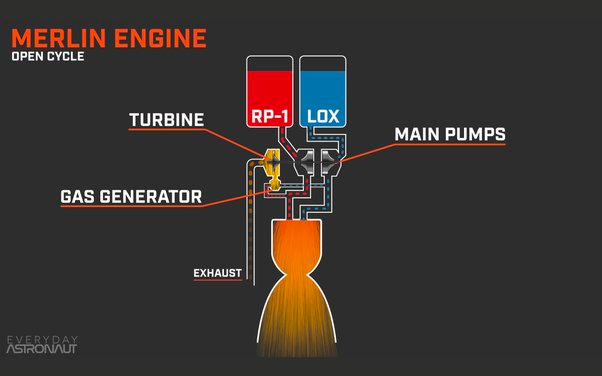
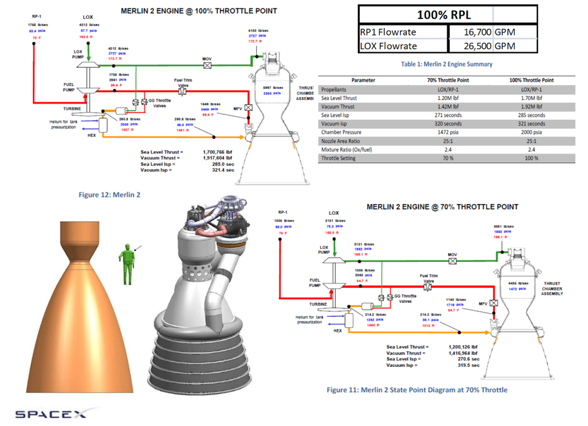
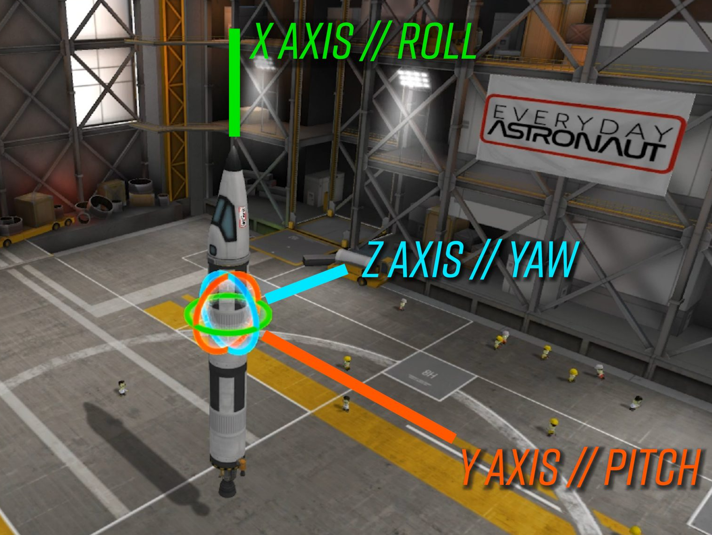
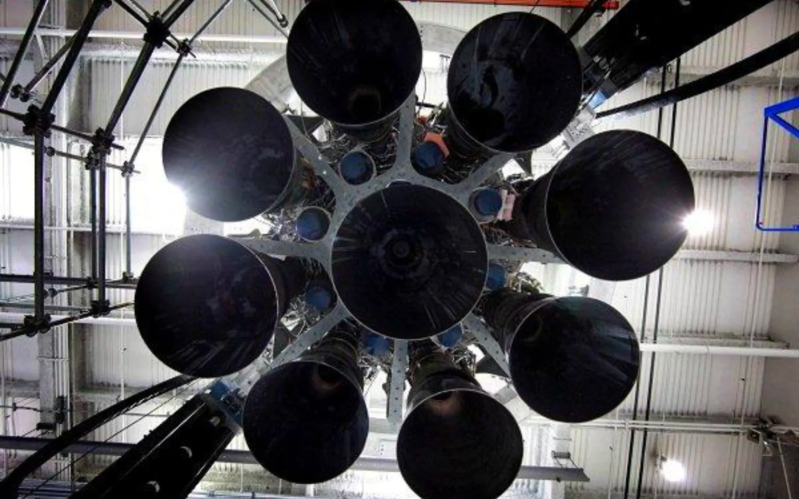

# Simulador SpaceX

El taller consiste en simular un cohete de SpaceX, en concreto un Falcon 9. Las físicas y controles de posición se han
simplificado y son ficticios siguiendo un poco la lógica.

## Installation

Para ejecutar en local: 

```bash
./gradlew build 
./gradlew bootRun 
```

## Fases de la misión

### 1.0 Check

Se trata de que todos los micro servicios respondan con un mensaje de Health Check, el micro servicio principal
(este proyecto) espera la siguiente respuesta:
```json
{
  "target": "Nombre micro servicio, por ejemplo 'engine'",
  "status": "Healthy"
}
```
---

### 2.0 Launch

Se trata de la fase de lanzamiento, y los micro servicios que entran en marcha son los siguientes:

#### 2.1 Engine - POST https://{api-url}/api/engine/launch

El motor tiene que primero presurizar la cámara a `2000` psia y poner él `Mode` en `FULL`, esto quiere decir que el 
atributo `throttle` hay que ajustarlo al 100%. 

**IMPORTANTE**: No se puede ajustar él `Mode` y `throttle` a la potencia
máxima si la cámara no se ha presurizado, tampoco podemos presurizar la cámara de golpe, cada `100 ms` debemos incrementar
`100 psia` hasta llegar al valor de `2000`. Quiere decir que tardará `2 segundos` en `incrementar la presión de 0 a 2000`.

Hay que tener en cuenta que tenemos 8 motores en comunicación con el cohete, en la parte de simulación con el Hardware
del cohete tendremos una interfaz controlando 8 motores.

La respuesta de este endpoint al finalizar los ajustes debe ser:
```json
{
  "engine": {
    "mode": "FULL",
    "throttle": 1,
    "chamberPressure": 2000
  }
}
```

#### 2.2 Kerosene Control - POST https://{api-url}/api/kerosene/launch

El control de Keroseno primero de todo debe activar la `mainValve` y seguidamente comenzar a bombear hasta llegar a 
`fuelPumpPercentage` del 100 % con el valor `1`, donde él `flowRate` irá incrementando hasta `801 kg/s` de combustible al 100%.

**IMPORTANTE**: No se puede ajustar él `fuelPumpPercentage` si la `mainValve` no está abierta. También debemos incrementar
la potencia de bombeo `40 kg/s` cada `100 ms`.

La respuesta de este endpoint al finalizar los ajustes debe ser:
```json
{
  "kerosene": {
    "mainValve": true,
    "ratio": 2.4,
    "fuelPumpPercentage": 1,
    "flowRate": 801
  }
}
```

#### 2.3 LOX Control - POST https://{api-url}/api/lox/launch

El control de oxígeno líquido primero de todo debe activar la `mainValve` y seguidamente comenzar a bombear hasta llegar a
`fuelPumpPercentage` del 100 % con el valor `1`, donde él `flowRate` irá incrementando hasta `1919 kg/s` de combustible al 100%.

**IMPORTANTE**: No se puede ajustar él `loxPumpPercentage` si la `mainValve` no está abierta. También debemos incrementar
la potencia de bombeo `95 kg/s` cada `100 ms`.

La respuesta de este endpoint al finalizar los ajustes debe ser:
```json
{
  "lox": {
    "mainValve": true,
    "ratio": 2.4,
    "loxPumpPercentage": 1,
    "flowRate": 1919
  }
}
```



#### 2.4 Turbo Pump - POST https://{api-url}/api/turbopump/launch

Para el funcionamiento del `Kerosene` y él `LOX` tenemos una turbina y dos bombas conectadas que son las que bombean los
diferentes combustibles. Esta bomba pone en marcha una turbina con él `throttle` al 100% donde las `rpm` irán incrementando
hasta `36000 rpm` con un resultado total de `hp` de `10000 hp`. Las `rpm` irán incrementando `1800 rpm` cada `100 ms`.

**IMPORTANTE**: Del JSON recibido deberemos comprobar que él `ratio` tanto del `lox` cómo `kerosene` corresponden 
con los `flowRate` del kerosene y lox, la fórmula es la siguiente: `lox flowRate` / `kerosene flowRate` = `ratio`, con 
un margen de error de un 5%.

La respuesta de este endpoint al finalizar los ajustes debe ser:
```json
{
  "turbopump": {
    "throttle": 1,
    "rpm": 36000,
    "hp": 10000
  }
}
```



---

### 3.0 Ascent

En la fase de ascenso entran en marcha el GPS, INS y Gimbal.

#### 3.1 GPS - POST https://{api-url}/api/gps/ascent

El GPS recibirá las coordenadas destino y se sitúa en las siguientes coordenadas:

##### Coordenadas actuales (las simulamos): 
    **Latitude**	28.573469

    **Longitude**	-80.651070

##### Coordenadas de aterrizaje:

    **Latitude** 28.775245058791235 

    **Longitude** -77.38535548520339

Se deben de hacer check que las coordenadas de destino están a menos de 350 km de radio.


#### 3.2 Gimbal - POST https://{api-url}/api/gimbal/ascent

Primero de todo, antes de implementar este micro servicio hay que entender que es `X Y Z` o `Roll, Pitch, Yaw` para el
control de orientación de un cohete (ver imagen).



Para este endpoint usaremos `**Yaw** para corregir Latitude` y `**Pitch** para corregir Longitud`.
El Gimbal debe funcionar de la siguiente manera, por cada diferencia entre coordenadas actuales y de aterrizaje se deberá
aumentar `1º`, por ejemplo `Longitude -80.651070 y -77.38535548520339` el resultado será un `Yaw` de `3,26º`, en cambio
a la inversa `Longitude -77.38535548520339 y -80.651070` el resultado será un `Yaw` de `-3,26º`

**IMPORTANTE**: Se debe controlar que los 3 atributos no pueden pasar de los 20º, ya que es el giro máximo del motor en
toda su circumferencia, en X Y Z tanto positivo como negativo.


Hay que tener en cuenta que tenemos 8 motores, por lo tanto 8 Gimbal en comunicación con el cohete (todos actúan en la
misma posición a la vez).



La respuesta de este endpoint al finalizar los ajustes debe ser:
```json
{
  "gimbal": {
    "roll": 0,
    "pitch": 0,
    "yaw": 3.26
  }
}
```

---

## Contributing

Pull requests are welcome. For major changes, please open an issue first
to discuss what you would like to change.

Please make sure to update tests as appropriate.

## License

[MIT](https://choosealicense.com/licenses/mit/)